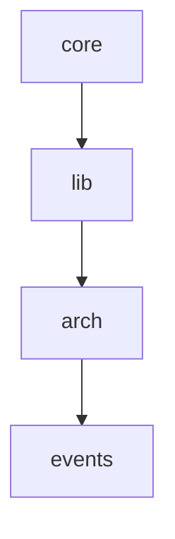

<!-- AUTO:START - Generated by devkit-plugin. DO NOT EDIT. -->
Automatisiert Code-Standards, Git-Conventions und Dokumentation via Claude Code Hooks. Single Source of Truth in config.jsonc.

## Principles

- **Config as Code**: config.jsonc als Single Source of Truth
- **Clean Architecture**: Layer-Boundaries werden enforced
- **Convention over Configuration**: Sensible Defaults
- **Transparency**: Alle Prompts und Regeln in der Config sichtbar

## Architecture

Clean Architecture: Imports nur von niedrigeren Tiers erlaubt.

| Layer | Tier | Description | May Import |
|-------|------|-------------|------------|
| `core` | 0 | Types, errors, constants - nur stdlib | stdlib only |
| `lib` | 1 | I/O-Adapter: config, git, tools, sync | core |
| `arch` | 2 | Architecture-Analyse und Visualisierung | core, lib |
| `events` | 3 | Claude Code Hook-Handler | core, lib, arch |



## Git Conventions

**Commit Types:** `feat | fix | chore | refactor | test | docs | perf | ci`

**Scope Mode:** `strict`

**Allowed Scopes:**

| Scope | Usage |
|-------|-------|
| `config` | - |
| `sync` | File sync system |
| `hook` | - |
| `arch` | Architecture, layer rules |
| `docs` | Documentation |
| `git` | Git workflow, PRs, branches |
| `skill` | - |
| `plugin` | Plugin system |
| `statusline` | - |
| `release` | - |
| `schema` | - |
| `session` | - |
| `validate` | - |
| `format` | - |
| `plan` | - |

**Internal Scopes (skip release notes):** `internal, review, ci, deps`

**Branch Pattern:** `{type}/{description}`

Example: `feat/add-login`, `fix/button-styling`

## Testing

**Framework:** `pytest` | **Coverage:** ≥70%

## Commands

**CRITICAL:** All commands via `/dk` - run `/dk` without args to see all.

**YOU MUST use `/dk` commands - NEVER use raw git/gh/vercel commands directly.**

## Development

```bash
# Development
npm run dev

# Testing
npm test  # pytest

# Build
npm run build
```

## Resources

- **Claude Code docs**: ALWAYS use Task tool with `subagent_type=claude-code-guide`
- **Library docs**: ALWAYS use Context7 MCP (`resolve-library-id` → `query-docs`)
- **Development Guide**: Read `docs/DEVELOPMENT.md` before making changes
<!-- AUTO:END -->

<!-- CUSTOM:START - Your documentation below. Preserved during updates. -->
## Project Specific

_Add your documentation here._
<!-- CUSTOM:END -->