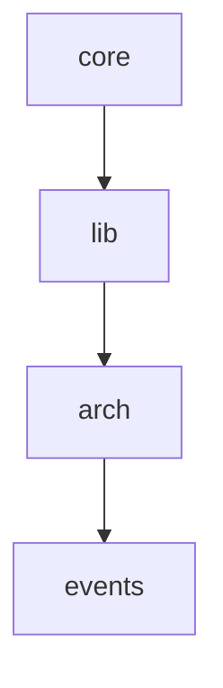

# Architecture Documentation

> Auto-generated from config.jsonc. Do not edit manually.

## Overview

## Architecture

Clean Architecture: Imports nur von niedrigeren Tiers erlaubt.

| Layer | Tier | Description | May Import |
|-------|------|-------------|------------|
| `core` | 0 | Types, errors, constants - nur stdlib | stdlib only |
| `lib` | 1 | I/O-Adapter: config, git, tools, sync | core |
| `arch` | 2 | Architecture-Analyse und Visualisierung | core, lib |
| `events` | 3 | Claude Code Hook-Handler | core, lib, arch |



## ASCII Diagram

```
Architecture Layers
============================================================

  ┌────────────────────┐
  │TIER 0: core        │  Types, errors, constants - nur
  └────────────────────┘
            │
            ▼
  ┌────────────────────┐
  │TIER 1: lib         │  I/O-Adapter: config, git, tool
  └────────────────────┘
            │
            ▼
  ┌────────────────────┐
  │TIER 2: arch        │  Architecture-Analyse und Visua
  └────────────────────┘
            │
            ▼
  ┌────────────────────┐
  │TIER 3: events      │  Claude Code Hook-Handler
  └────────────────────┘

Rule: Higher tiers may import from lower tiers only.
```

## Dependency Matrix

```
No dependencies to display.
```

## Layer Dependencies

| Layer | Imports |
|-------|---------|

## Rules

1. **Dependency Rule**: Higher tiers may only import from lower tiers
2. **Core Isolation**: Tier 0 has no internal dependencies (stdlib only)
3. **No Circular Imports**: Enforced by layer structure

## Enforcement

Enable runtime layer guard in development:

```python
import os
os.environ['DEVKIT_LAYER_GUARD'] = '1'

from core.layer_guard import enable_layer_guard
enable_layer_guard(strict=True)
```

---

Generated by [devkit-plugin](https://github.com/vndredev/devkit-plugin)